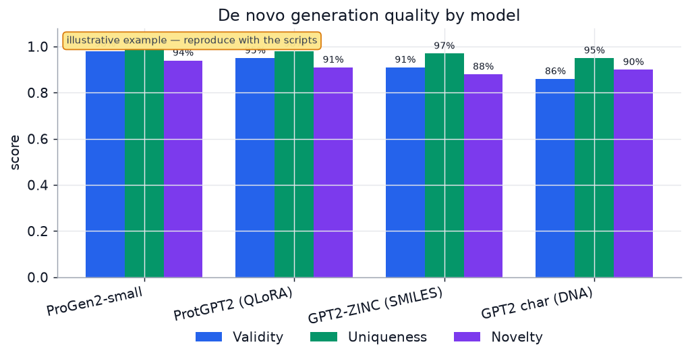
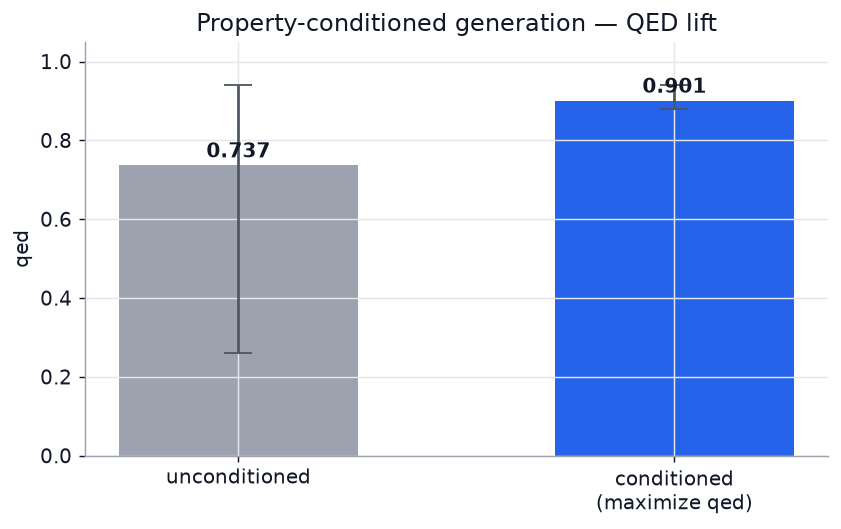

# De-Novo-LLM

> Fine-tune language models to generate **de novo biomolecules** — small
> molecules (SMILES/SELFIES), proteins/peptides, and nucleic acids (DNA/RNA) —
> from one modular, config-driven pipeline.


**Author:** Dr. Sanjay Anbu · **Website:** https://sanjaydoc.github.io/De-Novo-LLM/ ·
**Run guide:** [RUN.md](RUN.md) · **Model guide:** [docs/MODELS.md](docs/MODELS.md)

Built to run on modest hardware (developed against an **RTX 3000, 6GB VRAM**).
Three complementary tracks:

1. **Sequence generation** — fine-tune pretrained causal LMs (ProGen2 / ESM /
   ChemGPT) with **LoRA / QLoRA** (`denovo`).
2. **SE(3)-equivariant 3D structure generation** — an **E(3)-equivariant
   flow-matching** model (EGNN + conditional flow matching) that invents
   molecules as 3D atomic point clouds (`denovo-mol`). Equivariance is unit-tested.
3. **Closed-loop optimization** — a Design–Build–Test–Learn / active-learning
   backbone (surrogate + Bayesian acquisition + simulated oracle) that steers
   generation toward a target property (`denovo.closedloop`).

Cross-platform commands (Windows / macOS / Linux) are in **[RUN.md](RUN.md)**.

## Why a registry?

Every biomolecule type is described once in a **modality registry**
(`src/denovo/modalities.py`): how to validate a string, how to canonicalise it,
and a sensible default model. The `prepare → train → generate → evaluate`
machinery is completely modality-agnostic — so adding a new biomolecule type is
a few lines, not a new pipeline.

## Install

**Requires Python 3.12** — it has wheels for the whole stack (CUDA PyTorch,
RDKit, every dependency). Newer Pythons (3.13 / 3.14) are missing CUDA/RDKit
wheels. Install Python 3.12 from [python.org](https://www.python.org/downloads/)
first. Full step-by-step is in **[RUN.md](RUN.md)**.

### Linux
```bash
python3.12 -m venv .venv
source .venv/bin/activate
pip install torch
pip install -e ".[chem]"
```

### macOS
```bash
python3.12 -m venv .venv
source .venv/bin/activate
pip install torch
pip install -e ".[chem]"
```

### Windows (Command Prompt)
```bat
py -3.12 -m venv .venv
.venv\Scripts\activate.bat
pip install torch
pip install -e ".[chem]"
```

### Windows (PowerShell)
```powershell
py -3.12 -m venv .venv
.\.venv\Scripts\Activate.ps1
pip install torch
pip install -e ".[chem]"
```

**GPU (optional, for real training):** replace `pip install torch` with
`pip install torch --index-url https://download.pytorch.org/whl/cu128`
(needs an NVIDIA GPU + Python 3.12). CPU is fine for all the smoke tests below.
`.[chem]` adds RDKit + SELFIES; the core install already includes numpy,
matplotlib, optuna and pytest.

**Console scripts vs `python -m`:** installing may warn that the `denovo` /
`denovo-mol` scripts aren't on `PATH`. Either activate a venv (which puts them
on `PATH`), or call them as modules — both forms are shown below.

## 60-second smoke tests (CPU, no GPU / network needed)

Prove each track works end-to-end:

```bash
# SE(3)-equivariant flow-matching 3D generator
denovo-mol pipeline -c configs/mol_flow_smoke.yaml
python -m denovo.structure.cli pipeline -c configs/mol_flow_smoke.yaml   # same, module form

# Sequence-LLM pipeline (builds a tiny local model first, fully offline)
python scripts/make_tiny_local_model.py
denovo pipeline -c configs/smoke_local.yaml

# Closed-loop Bayesian optimization demo
python scripts/closed_loop_demo.py

# Tests
python -m pytest        # 31 passing
```

> **RDKit note:** RDKit is optional. On some locked-down Windows machines its
> DLL is blocked by *Smart App Control / Application Control* (`DLL load failed …
> An Application Control policy has blocked this file`). Everything still runs
> without it — you only lose SMILES-based validity/uniqueness/novelty metrics
> (atom & molecule *stability* are computed without RDKit). See RUN.md §9.

## Real runs

```bash
# 1. Clean your raw data into train/eval splits (validates + canonicalises)
denovo prepare  -c configs/small_molecule.yaml -i data/your_smiles.txt

# 2. Fine-tune
denovo train    -c configs/small_molecule.yaml

# 3. Generate novel molecules
denovo generate -c configs/small_molecule.yaml -n 1000 -o generated/mols.txt

# 4. Score them (validity / uniqueness / novelty / diversity)
denovo evaluate -c configs/small_molecule.yaml -i generated/mols.txt

# ...or all four at once:
denovo pipeline -c configs/small_molecule.yaml -i data/your_smiles.txt
```

### SE(3)-equivariant 3D molecule generation

A from-scratch **E(3)-equivariant flow-matching** generator (EGNN backbone +
conditional flow matching over atom coordinates & types). The coordinate
velocity field is rotation/translation-equivariant and the atom-type field is
invariant — verified empirically (`tests/test_structure.py`) to ~1e-7.

```bash
# Offline smoke test — trains + samples + evaluates on CPU, no network/RDKit
denovo-mol pipeline -c configs/mol_flow_smoke.yaml

# Real training on 3D molecules (point data.sdf_path at e.g. QM9); needs RDKit
pip install rdkit
denovo-mol train  -c configs/mol_flow.yaml
denovo-mol sample -c configs/mol_flow.yaml -n 1000 -o generated/mols
```

Metrics reported: atom stability, molecule stability, validity, uniqueness,
novelty (EDM-style). At default settings the model is ~1–2M params and fits a
6GB GPU comfortably.

### Bayesian hyperparameter optimization

Tune decoding hyperparameters against the quality metrics with Optuna's TPE
(Bayesian) sampler — no retraining needed:

```bash
denovo optimize -c configs/progen2_protein.yaml \
    --mode sampling -m outputs/progen2_small --trials 25 \
    -o docs/results/bo_study.json
python scripts/make_figures.py --study docs/results/bo_study.json
```

### Property-conditioned generation

Steer the de novo model toward molecules with a target property — maximize QED,
hit a target logP, minimize molecular weight, etc. (RDKit objectives). Best-of-N
guided sampling works with any pretrained checkpoint, no retraining:

```bash
# Maximize drug-likeness (QED)
denovo condition -c configs/molecule_benchmark.yaml -m entropy/gpt2_zinc_87m \
    --property qed --mode max -n 200 --oversample 10 -o generated/qed.txt

# Hit a target logP of 2.5
denovo condition -c configs/molecule_benchmark.yaml -m entropy/gpt2_zinc_87m \
    --property logp --mode target --target 2.5 -n 200

# Visualise the distribution shift (unconditioned vs conditioned)
python scripts/property_conditioning.py -m entropy/gpt2_zinc_87m --property qed --mode max
```

Properties: `logp`, `qed`, `mw`, `tpsa`, `hbd`, `hba`, `rings`, `rotbonds`. The
command reports the property distribution before vs after steering. Under the
hood the objective is the same interface the closed-loop backbone optimizes, so
the property can drive the full DBTL loop too.

### Scaffold-constrained generation

Generate molecules that **contain a required substructure** (a scaffold or
core), matched with RDKit — optionally ranked by a property at the same time:

```bash
# Molecules containing a benzene ring
denovo scaffold -c configs/molecule_benchmark.yaml -m entropy/gpt2_zinc_87m \
    --scaffold "c1ccccc1" -n 100 --oversample 20 -o generated/aromatic.txt

# Molecules containing a sulfonamide core, ranked by QED
denovo scaffold -c configs/molecule_benchmark.yaml -m entropy/gpt2_zinc_87m \
    --scaffold "S(=O)(=O)N" --smarts --property qed --mode max -n 100
```

Reports the **constraint-satisfaction rate** (fraction of valid molecules that
contain the scaffold). Pass `--smarts` to use a SMARTS query instead of SMILES.

### NVIDIA NIM cloud inference (big models that don't fit locally)

For models too large for a 6GB GPU — **MolMIM** (controlled molecule generation
/ optimization), **ESMFold** (sequence → structure), **Evo 2** (genomic) — call
NVIDIA's hosted NIMs. Get a free key at [build.nvidia.com](https://build.nvidia.com),
then:

```bash
# bash: export NVIDIA_API_KEY=nvapi-...      Windows: set NVIDIA_API_KEY=nvapi-...

denovo nim --service list
# Generate + optimize molecules around a seed (MolMIM, CMA-ES on QED)
denovo nim --service molmim --smi "CC(=O)Oc1ccccc1C(=O)O" -n 30 --property QED -o generated/nim.txt
# Fold a protein sequence (ESMFold) -> PDB
denovo nim --service esmfold --sequence MKTAYIAKQR... -o structure.pdb
```

This is the cloud complement to the local tracks: generate/optimize locally,
then call a NIM for capabilities that need cloud scale.

Inspect what a config resolves to:

```bash
denovo info -c configs/progen2_protein.yaml
```

## Which model should I use?

Short answer for a 6GB laptop and **de novo** quality: start with
**ProGen2-small** (`configs/progen2_protein.yaml`). Full comparison of
Evo 2 / ESM-3 / BioMistral-7B / ProGen2 / GPT2-ZINC and what fits your GPU is in
**[docs/MODELS.md](docs/MODELS.md)**.

| Modality | Default config | Model | Fits 6GB |
|----------|----------------|-------|----------|
| Small molecules (SMILES) | `configs/small_molecule.yaml` | `entropy/gpt2_zinc_87m` | ✅ full fine-tune |
| Protein (recommended) | `configs/progen2_protein.yaml` | `hugohrban/progen2-small` | ✅ full fine-tune |
| Protein (larger) | `configs/protein.yaml` | `nferruz/ProtGPT2` | ✅ QLoRA |
| DNA / RNA | `configs/nucleic_acid.yaml` | `gpt2` char-level / HyenaDNA | ✅ |
| Biomedical text | `configs/biomistral_7b.yaml` | `BioMistral/BioMistral-7B` | ⚠️ QLoRA, tight |

## Configuration

A run is one YAML file with five sections — `data`, `model`, `lora`, `train`,
`generate`. Only override what you need; everything else uses 6GB-friendly
defaults. See `src/denovo/config.py` for every field and its default.

```yaml
data:
  modality: smiles                 # smiles | selfies | protein | dna | rna
  train_file: data/my_smiles.txt
model:
  pretrained_model: entropy/gpt2_zinc_87m   # any HF causal LM; blank = modality default
lora:
  use_lora: false                  # true = LoRA; add model.load_in_4bit for QLoRA
train:
  output_dir: outputs/run
  fp16: true
generate:
  num_samples: 1000
```

## Benchmark results

De novo small-molecule generation with **GPT2-ZINC (87M, zero-shot)** — 1,000
generated SMILES scored against a 50k-molecule ZINC reference set (RDKit metrics):

| Model | Samples | Validity | Uniqueness | Novelty | Diversity |
|-------|---------|----------|------------|---------|-----------|
| GPT2-ZINC (zero-shot) | 1,000 | **100%** | **100%** | **100%** | **0.85** |



**Property-conditioned generation** — steering the same model to maximize QED
(drug-likeness) lifts the mean QED and concentrates the output in high-QED space:

| QED (drug-likeness) | Mean | Range |
|---------------------|------|-------|
| Unconditioned | 0.737 | 0.26 – 0.94 |
| Conditioned (max QED) | **0.901** | 0.88 – 0.94 |



**Scaffold-constrained generation** — requiring a benzene ring (`c1ccccc1`):
57.4% of generated valid molecules contain it unconstrained; the output is
filtered to **100% constraint satisfaction**.

| Constraint | Generated (valid) | Contain scaffold | Output |
|------------|-------------------|------------------|--------|
| benzene `c1ccccc1` | 2,000 | 1,148 (57.4%) | 100 (100% match) |

Reproduce:

```bash
python scripts/download_smiles.py --max 50000 -o data/zinc.txt
denovo generate  -c configs/molecule_benchmark.yaml -m entropy/gpt2_zinc_87m -n 1000 -o generated/base.txt
denovo evaluate  -c configs/molecule_benchmark.yaml -i generated/base.txt
denovo condition -c configs/molecule_benchmark.yaml -m entropy/gpt2_zinc_87m --property qed --mode max -n 200 --oversample 10
denovo scaffold  -c configs/molecule_benchmark.yaml -m entropy/gpt2_zinc_87m --scaffold "c1ccccc1" -n 100 --oversample 20
```

## Metrics

`denovo evaluate` reports the field-standard de novo metrics:

- **Validity** — fraction of generations that parse (RDKit for molecules;
  alphabet checks for sequences).
- **Uniqueness** — distinct valid / valid.
- **Novelty** — valid-unique not present in the training set (canonicalised).
- **Diversity** — mean pairwise Morgan-fingerprint distance (molecules; needs RDKit).

## Project layout

```
configs/            ready-to-run YAML configs (start with smoke.yaml)
data/samples/       tiny example datasets (SMILES / protein / DNA)
docs/MODELS.md      model comparison + 6GB feasibility guide
src/denovo/
  modalities.py     the registry: validators, canonicalisers, defaults
  config.py         typed YAML config
  data.py           read / clean / tokenise
  model.py          load model+tokenizer, LoRA / QLoRA
  train.py          HF Trainer fine-tuning loop
  generate.py       sampling
  evaluate.py       validity / uniqueness / novelty / diversity
  optimize.py       Bayesian (Optuna/TPE) hyperparameter search
  cli.py            `denovo` command-line entry point
  structure/        SE(3)-equivariant flow-matching 3D generator (`denovo-mol`)
    egnn.py           E(3)-equivariant GNN backbone
    flow.py           conditional flow-matching + zero-CoM utilities
    model.py          velocity field + loss + ODE sampler
    chem.py           atom vocab, bond inference, stability metrics
  closedloop/       DBTL / active-learning optimization backbone
    oracle.py         budgeted noisy simulated experiment
    surrogate.py      uncertainty-aware models (deep ensemble / GP)
    acquisition.py    EI / UCB / PI / Thompson + batch selection
    loop.py           active-learning orchestrator
tests/              unit tests (core, structure equivariance, closed loop)
```

## Roadmap

- ✅ Modular modality registry (molecules / proteins / nucleic acids)
- ✅ Fine-tune (full / LoRA / QLoRA), generate, evaluate
- ✅ **SE(3)-equivariant flow-matching 3D molecule generator** (EGNN + CFM)
- ✅ Closed-loop DBTL / active-learning optimization backbone
- ✅ Bayesian hyperparameter optimization (Optuna / TPE)
- ✅ Benchmarking + figure pipeline and GitHub Pages website
- ✅ Property-conditioned generation (logP, QED, MW … via RDKit objectives)
- ✅ NVIDIA NIM cloud inference (MolMIM · ESMFold · Evo 2)
- ✅ Scaffold / substructure-constrained decoding (RDKit substructure filter)

## Author & citation

**Dr. Sanjay Anbu** — [github.com/sanjaydoc/De-Novo-LLM](https://github.com/sanjaydoc/De-Novo-LLM)

```bibtex
@software{anbu_denovo_llm_2026,
  author = {Dr. Sanjay Anbu},
  title  = {De-Novo-LLM: Fine-tuning language models for de novo biomolecule generation},
  year   = {2026},
  url    = {https://github.com/sanjaydoc/De-Novo-LLM}
}
```

## License

Released under the [MIT License](LICENSE) © 2026 Dr. Sanjay Anbu.
